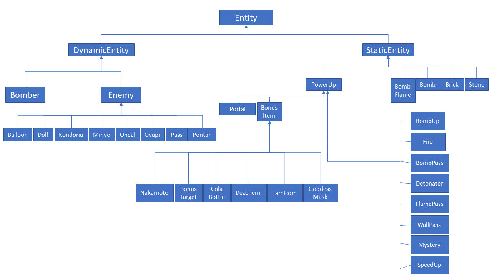

# Bài tập lớn môn Lập trình hướng đối tượng (OOP) - Trường Đại học Công nghệ - Đại học Quốc gia Hà Nội (UET)
# Game Bomberman - Đặt bom

### Các thành viên
  - Nguyễn Đăng Hoàng Đạo : Trưởng nhóm
  - Trần Thị Kim Bắc : Thành viên
  - Trần Đình Cường : Thành viên

### Sử dụng
  - Java 11
  - Javafx 11

### Các chức năng chính
  - Gameplay giống với bản classic
  - Bổ sung bản đồ con
  - Có thể thay đổi độ phân giải
  - Có âm thanh
  - Sử dụng A* làm thuật toán tìm đường

### Thành viên:
- Trần Thị Kim Bắc
- Trần Đình Cường
- Nguyễn Đăng Hoàng Đạo

### Hướng dẫn chơi
- Di chuyển bằng 4 phím mũi tên
- Bấm A để đăt bom
- Bấm S để kích nổ bom
- Bấm M để tắt/mở bản đồ con

### Cây thừa kế

https://strategywiki.org/wiki/Bomberman/How_to_play
